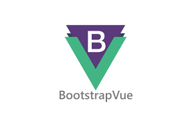
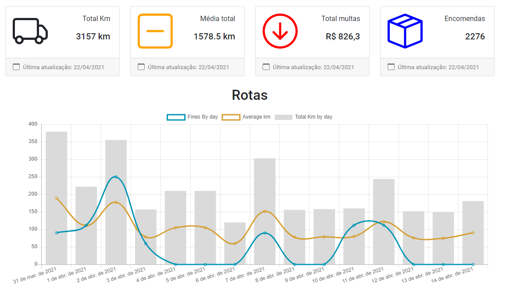

<p align="center">
   
</p>

<p align="center">
  
 

  <a aria-label="Last Commit" href="https://github.com/Olliveer/Olliveer-nlw/commits/master">
    
  </a>
  <a href="https://github.com/Olliveer/plantmanager/commits/master">
    
  </a>
  
</p>

<b>Dashboard-vue</b> é uma dashboard simples que mostra as informações em gráfico das rotas percorridas em um intervalo de 15 dias.

# :pushpin: Conteúdo

- [Tecnologias](#computer-tecnologias)
- [Executando](#construction_worker-executando)
- [Autores](#computer-autores)
- [Licença](#closed_book-licença)

### Telas

<div align="center">
  
</div>

# :computer: Tecnologias

Este projeto foi feito utilizando as seguintes tecnologias:

- [Bootstrap-vue](https://bootstrap-vue.org/)
- [Vue-chartjs](https://vue-chartjs.org/)
- [Chartjs](https://www.chartjs.org/)
- [Axios](https://github.com/axios/axios)
- [Vuejs](https://vuejs.org/)
- [Vuex](https://vuex.vuejs.org/)

# :construction_worker: Executando

## 1. Clone o Repositório

```bash
https://github.com/Olliveer/dash-vue.git
```

## 2. Instale as Dependencias

```bash
yarn
```

## 5. Inicie o server

```bash
$ yarn serve
```

# :closed_book: Licença

Esse projeto está sob a licença MIT. Veja o arquivo [LICENSE](LICENSE) para mais detalhes.

---

[](https://www.linkedin.com/in/joseooliveira/)
